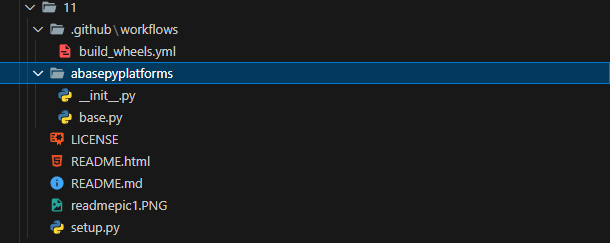

# Platform Specific Wheel

#### package used to build wheels
+ cibuildwheel

## Steps to reproduce
+ 
+ copy this into setup.py file

			import  os

			from  os.path  import  join

			from  setuptools  import  setup,Extension

			from  Cython.Build  import  cythonize

			directory_path  =  os.path.dirname(

			os.path.abspath(__file__)

			)  
			ext_data  = {

			'PACKAGE-NAME-HERE':{

			'sources':[join(directory_path,'FOLDER-NAME','base.py')]

			}

			}  
			extensions  = []
			for  name,data  in  ext_data.items():
			sources  =  data['sources']
			include  =  data.get('include',[])
			obj  =  Extension(
			name,
			sources=sources,
			include_dirs=include
			)  
			extensions.append(obj)
			setup(
			name="PUT-PACKAGE-NAME-HERE",
			version="0.0.1",
			install_requires=[
			"pip","setuptools","langchain","sqlalchemy","pymysql"
			],
			ext_modules=cythonize(extensions)
			)
+ *replace package-name with name of your package*
+ create github action by .github\workflows\build_wheels.yml
+ copy this , you can refer to cibuildwheel docs for more info https://cibuildwheel.readthedocs.io/en/stable/
			

			  
			name:Build
			on: [push, pull_request]
			jobs:
			build_wheels:
			name: Build wheels on ${{ matrix.os }}
			runs-on: ${{ matrix.os }}
			strategy:
			matrix:
			os: [ubuntu-20.04, windows-2019, macos-11]	  
			steps:

			- uses: actions/checkout@v4
			- name: Build wheels
			uses: pypa/cibuildwheel@v2.16.2
			env:
			CIBW_BEFORE_BUILD: python -m pip install Cython
			- uses: actions/upload-artifact@v3
			with:
			path: ./wheelhouse/*.whl
+ **CIBW_BEFORE_BUILD** line is important , it tells cibuildwheel to install Cython before compiling the package
+ now make a github repo and add these files
+ on pushing , a github workflow will start creating wheels
+ at the end you will be given with artifacts which contains wheel for specific platforms

## setup.py
This files convert py code into .pyd format . it also contains dependencies needed for installation

## build_wheels.yml
This is Github Actions workflow file needed for cibuildwheel

## Notes
+ Check the cibuildwheel docs for further updates
+ i added wheels for almost all platforms , you can add more  by editing build_wheels.yml file
+ you can tweak things as you wish in build_wheels.yml file and push to github for workflow to work
+ don't remove **CIBW_BEFORE_BUILD** line in build_wheels.yml file

## Reference
+ https://medium.com/@xpl/protecting-python-sources-using-cython-dcd940bb188e
+ https://iscinumpy.dev/post/overview-of-cibuildwheel/ -> cibuildwheel docs
+ https://cibuildwheel.readthedocs.io/en/stable/setup/#configure-a-ci-service -> cibuildwheel docs for configuring build_wheels.yml
+ https://www.youtube.com/watch?v=53l4HApVUKU&t=547s -> video referred to convert python code to pyd
 (setup.py) codes are referenced from this video